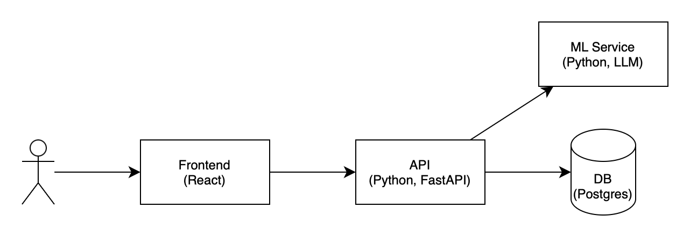

# Система автоматизированного прохождения собеседования

## Верхнеуровневая архитектура



* Пользователь взаимодействует с Frontend, написанном на React
* Запросы направляются в API Backend, написанном на FastAPI
* Backend взаимодействует с Postgres для манипуляции с данными и общается с ML Service для генерации списка вопросов и оценки ответов

## Запуск приложения

Сначала нужно скопировать шаблон для переменных окружения и заполнить его своими данными

```bash
cp .env.template .env
```

Приложение разворачивается с помощью docker compose:

```bash
docker compose up -d
```

* Backend доступен на порту 8000 (http://localhost:8000/docs)
* ML Service доступен на порту 8080 (http://localhost:8080/docs) (по желанию можно убрать во внутренний контур)

Backend, Postgres и ML Service находятся в одной сети

## Запуск тестов

```bash
docker compose up backend_tests
docker compose up ml_service_tests
```

## Деплой

### Создание виртуальной машины

Для создания виртуальной машины используется `multipass`. Запустить скрипт:

```shell
./deploy/create_vm.sh
```

Нужно заменить название SSH-ключа и IP-адрес виртуальной машины в `deploy/inventory.yml`

### Сборка и сохранение образов в Docker Hub

```shell
ansible-playbook -i deploy/inventory.yml deploy/playbook.yml
```
